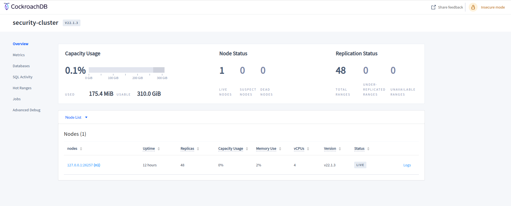
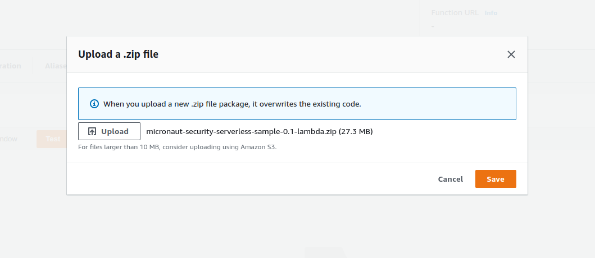
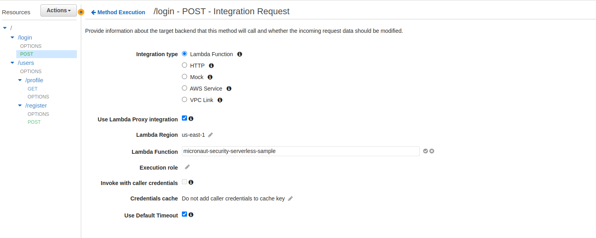

# micronaut-security-serverless-sample
Sample serverless application using Micronaut (Security, Data, AWS), API Gateway and GraalVM

- [x] [Micronaut 3.5.3](https://micronaut.io/)
- [x] [SAM](https://aws.amazon.com/pt/serverless/sam/)
- [x] [Cockroach](https://www.cockroachlabs.com/)
- [x] [TestContainers](https://www.testcontainers.org/modules/databases/jdbc/)
- [x] Java 11


### Build for JVM execution
```console
micronaut-security-serverless-sample % make build
```

### Build for GraalVM execution
```console
micronaut-security-serverless-sample % make build-graalvm
```

### Start Application
This command starts the docker containers, sam local api and build the project.
```console
micronaut-security-serverless-sample % make run
```

### Debug Application
1 - Configure intellij remote debugging.

2 - Execute this command
```console
micronaut-security-serverless-sample % make debug
```

3 - Send request

4 - Start debug

-----

## Local Execution

### Create user
```json
POST /users/register HTTP/1.1
Host: localhost:3000
Content-Type: application/json
        
{
"email": "user@gmail.com",
"password": "12345678"
}
```
### Authenticate user
```json
POST /login HTTP/1.1
Host: localhost:3000
Content-Type: application/json
        
{
"username": "user@gmail.com",
"password": "12345678"
}
```

### Cockroach client

```console
http://localhost:8080
```


### SQL Commands

You can use docker exec to execute sql commands in local cockroach
```console
docker exec cockroach-db /cockroach/cockroach sql --insecure --database=security --execute="INSERT INTO public.tb_role (id, "type") VALUES(1, 'ROLE_USER');"
```

### Deploy for GraalVM Compilation

1 - For GraalVM compilations, create an aws lambda function with Amazon Linux 2 custom runtime.


2 - Upload the zip file generated by the build
```console
micronaut-security-serverless-sample/build/libs/micronaut-security-serverless-sample-0.1-lambda.zip
```


3 - Add the environment variables with cockroach database parameters.
[You can create a free tier serverless cockroach database
](https://www.cockroachlabs.com/get-started-cockroachdb/)


4 - Change memory to 256 MB


### Integrate with API Gateway

1 - Create a REST API Gateway


2 - Map each route in the API gateway and enable lambda integration proxy



3 - Deploy API gateway stage


### Requests to api gateway

- Register user

- Authenticate user

